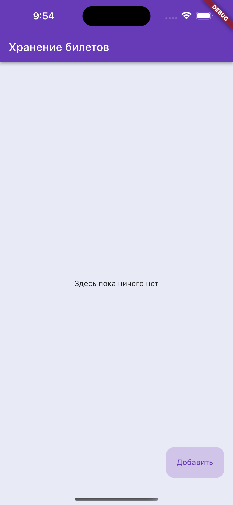
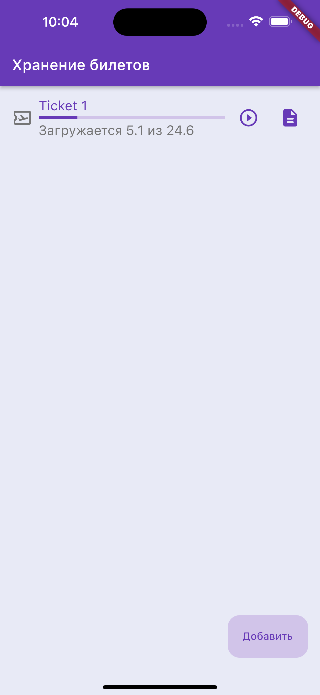
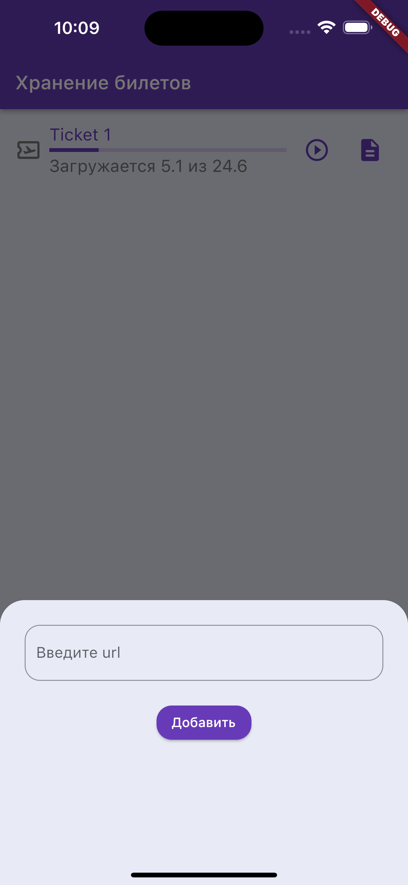
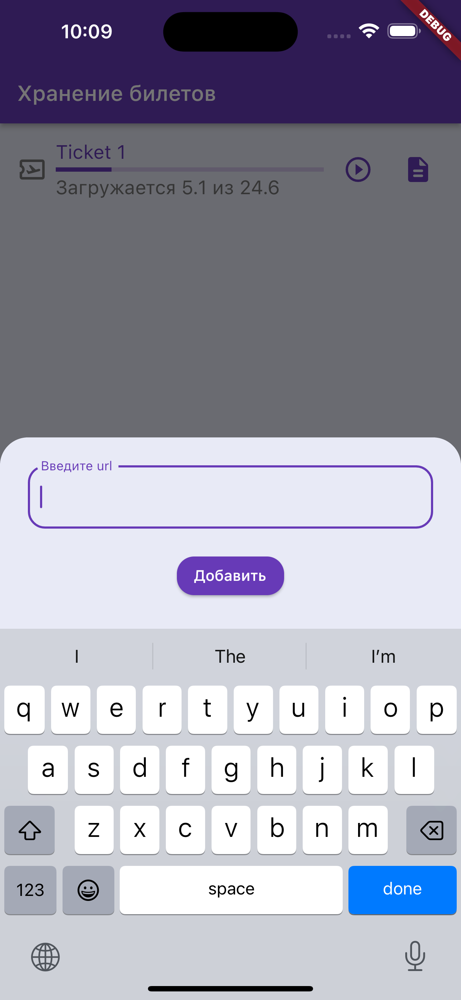
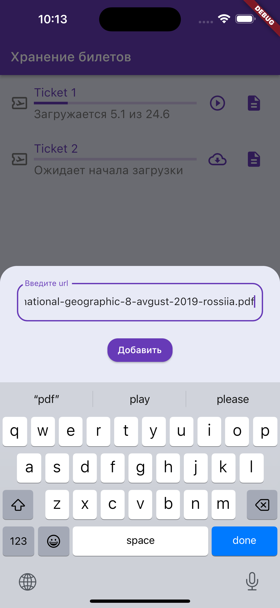
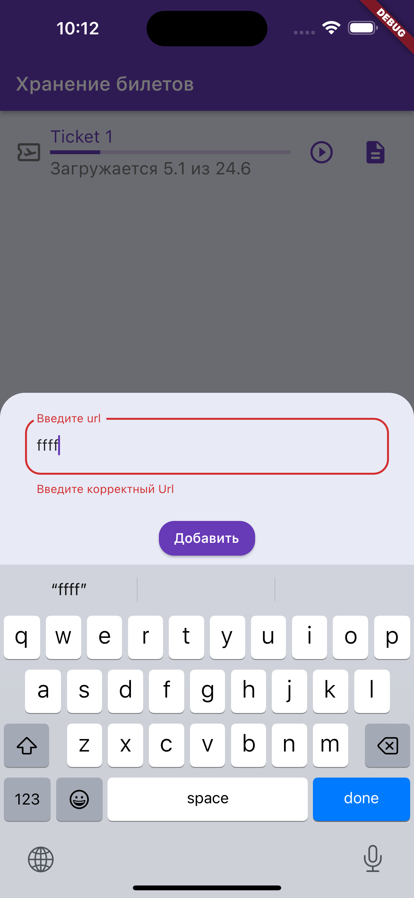
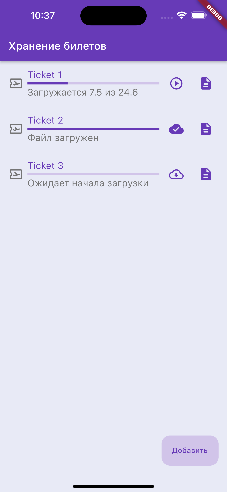
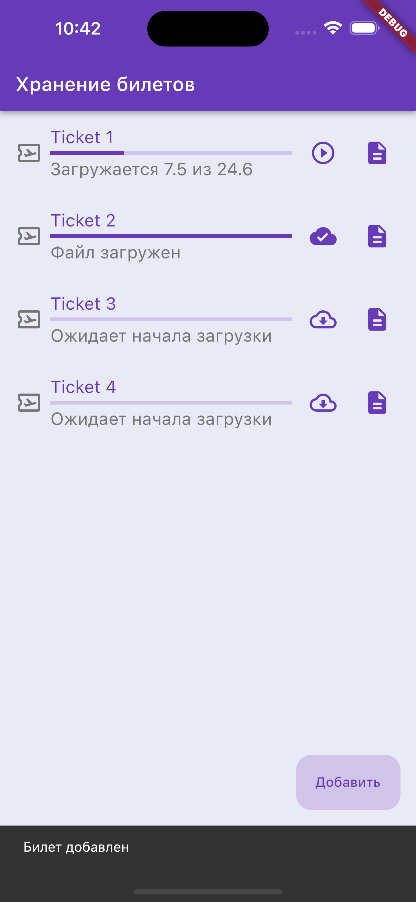

# Целевая платформа

Платформа: ios 16.2

# Результаты

#### Общие компоненты экрана
:white_check_mark: Аппбар с заголовком “Хранение билетов”;  
:white_check_mark: Кнопка “Добавить”, которая открывает модальное окно “Добавление ссылки”;  

#### Состояние отсутствия данных
:white_check_mark: При отсутствии скачанных или доступных для скачивания файлов должен отображаться экран с надписью “Здесь пока ничего нет”;  

#### Состояние загрузки данных
:white_check_mark: В процессе загрузки доступных для скачивания файлов должен отображаться прогресс загрузки.  

#### Модалка “Добавление ссылки”
:white_check_mark: Текстовое поле с предложением ввести URL  
:white_check_mark: Кнопка “Добавить”  
:white_check_mark: По нажатию кнопки “Добавить” валидируется поле с URL по параметрам соответствующим URL.  
:white_check_mark: Если валидация проходит, на основной экран добавляется один элемент “Файл”.  
:x: Если в буфере обмена есть ссылка формата .pdf обеспечьте её автоматическую подстановку в поле ввода url.  

  
  

  
  

#### Компонент “Билет”
:white_check_mark: При успешном добавлении билет появляется в общем списке, но скачивание не начинается автоматически.  
:white_check_mark: Иконка билета  
:pencil2: Название файла, формируется при добавлении билета в список по внутреннему правилу.  
:white_check_mark: Кнопка загрузки  
:heavy_plus_sign: Кнопка просмотра загруженного файла  

:white_check_mark: Кнопка загрузки находится в состоянии доступной для скачивания. По её нажатию начинается скачивание файла.  

:white_check_mark: Индикатор прогресса загрузки файла.  
:white_check_mark: Индикатор прогресса загрузки в Мбайтах: текущее значение и общий вес файла.  
:white_check_mark: Кнопка загрузки меняется на паузу. По её нажатию останавливается загрузка файла.  
(:bug: Баг: если повторно нажать на паузу то загрузка продолжается, то есть пауза отрабатывает один раз на одно скачивание)  

В состоянии, когда файл загружен и находится на устройстве:  
:pencil2: Тап работает но коллбэка нет

## Итого:

### Задание 1
:white_check_mark: Интерфейс экрана: Аппбар, состояния экрана, модальное окно (или боттомшит), кнопки, карточка файла.  

### Задание 2
:white_check_mark: Логика добавления ссылки на загрузку файла. Валидацию данных.  
:white_check_mark: Отображение снекбара при успешном добавлении ссылки.  
:x: При наличии ссылки формата .pdf в буфере обмена обеспечить её автоматическую подстановку в поле ввода url.  
:x: Сохранение списка файлов в локальном хранилище.  

### Задание 3
:white_check_mark: Логика отображения списка файлов.  
:x: Добавить скрытие кнопки добавления ссылки, если долистали список до конца.  
:x: Сортировка файлов по дате добавления, по состоянию загрузки с сохранением в локальной базе данных.  

### Задание 4
:white_check_mark: Реализация процесса загрузки и сохранения файлов.  
:x: Удаление файла из хранилища.  
:x: Загрузка всех незагруженных файлов по одной кнопке.  

### Задание 5
:white_check_mark: Открытие pdf файла для просмотра на отдельном экране.  

